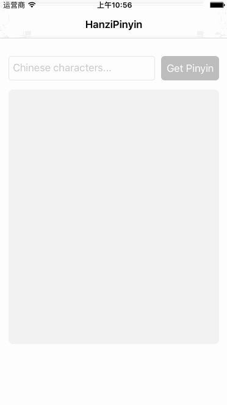

# HanziPinyin
A lightweight Swift library supporting convertion between Chinese(both Simplified and Tranditional) characters and Pinyin.



## How To Get Started
### Carthage
Specify "HanziPinyin" in your ```Cartfile```:
```ogdl 
github "teambition/HanziPinyin"
```

### CocoaPods
Specify "HanziPinyin" in your ```Podfile```:
```ruby 
source 'https://github.com/CocoaPods/Specs.git'
platform :ios, '8.0'
use_frameworks!

pod 'HanziPinyin'
```

### Usage
#### Pinyin output format
```swift
// PinyinToneType: none, toneNumber
// PinyinVCharType: vCharacter, uUnicode, uAndColon
// PinyinCaseType: lowercased, uppercased, capitalized
let outputFormat = PinyinOutputFormat(toneType: .none, vCharType: .vCharacter, caseType: .lowercased)
```
####  Convert to Pinyin synchronously
```swift
print("我爱中文".toPinyin(withFormat: outputFormat, separator: " "))
// wo ai zhong wen

print("我愛說中國話".toPinyin(withFormat: outputFormat, separator: " "))
// wo ai shuo zhong guo hua

print("我爱中文".toPinyinAcronym())
// wazw

print("I love Chinese.".toPinyin())
// I love Chinese.
```

####  Convert to Pinyin asynchronously
```swift
"我爱中文".toPinyin { (pinyin) in
    // do something
}

"我爱中文".toPinyinAcronym { (pinyin) in
    // do something
}
```

####  Chinese character detecting
```swift
print("我爱中文".hasChineseCharacter)
// true
print("I love Chinese.".hasChineseCharacter)
// false
```

## Minimum Requirement
iOS 8.0

## Release Notes
* [Release Notes](https://github.com/teambition/HanziPinyin/releases)

## License
HanziPinyin is released under the MIT license. See [LICENSE](https://github.com/teambition/HanziPinyin/blob/master/LICENSE.md) for details.

## More Info
Have a question? Please [open an issue](https://github.com/teambition/HanziPinyin/issues/new)!
